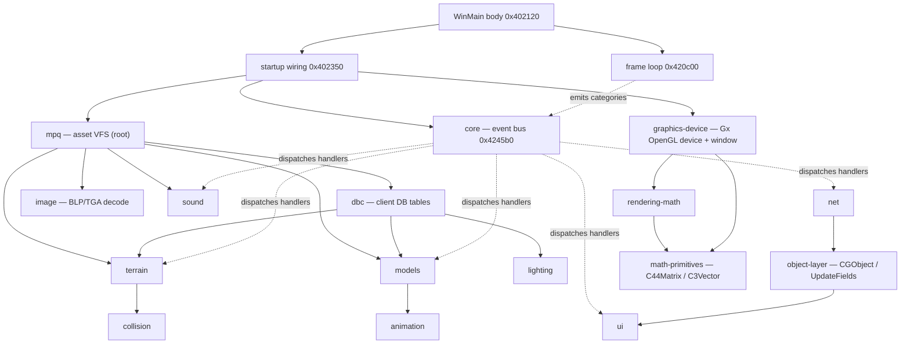

# Architecture overview

The 1.12.1 client is not a fixed `input(); update(); render(); present();` call sequence. It is a
**per-frame event-scheduler loop** with a **single seam — an event bus**: every subsystem registers a
priority-sorted handler per event category, and the loop fans those handlers out each tick by emitting a
fixed sequence of category indices. A separate startup path wires the subsystems together — it mounts the
MPQ asset VFS, opens the DBC tables, and creates the rendering device and window — leaving a dependency
graph rooted at the asset VFS. This chapter describes that spine; the per-subsystem mechanism lives in the
chapters it links to.

## The shape: one loop, one seam

The most important structural finding is that per-frame work is **data-driven**. Subsystems (render, world,
net, UI, sound) do not appear as hard-coded calls inside the loop. Instead they each register handlers on a
per-frame event-category list, and the loop broadcasts to them through one dispatch primitive. A faithful
client must model this — assuming a static call order would diverge from the binary, and a static
call-graph naturally *stops* at the dispatch indirection, which is exactly what makes that indirection the
boundary between the core spine and every subsystem.

So there are two structures to understand:

1. **The runtime seam** — the event bus the loop fans out each tick (covered here and in [core](core.md)).
2. **The build-time wiring** — the startup path that creates the subsystems and registers their handlers,
   rooting a dependency graph at the asset VFS.

## Bootstrap: PE entry → WinMain → the loop

All addresses are virtual addresses (image base `0x400000`). The chain from process start to the frame loop:

| VA | what |
|---|---|
| `0x401000` | PE entry (RVA 0x1000) — calls CRT pre-init then CRT startup |
| `0x645010` | CRT pre-init (security cookie / heap bootstrap) |
| `0x4098c0` `__tmainCRTStartup` | MSVC CRT startup; resolves command line, then calls WinMain |
| `0x404100` | WinMain wrapper — `_controlfp(0x9001f, -1)` sets the FPU control word, process-token ACL hardening, then the real body |
| `0x402120` | WinMain body (identified by the string `"World of WarCraft (build 5875)"`) — runs startup wiring `0x402350`, then loop-entry `0x420be0`, then teardown `0x403bc0` |
| `0x420be0` → `0x420c00(1)` | loop-entry thunk; sole caller of the frame loop |

The statically-linked MSVC runtime below `0x645010`/`0x4098c0` is not part of the client's own logic; the
client's behavior is rooted at the frame loop `0x420c00`. Note that `_controlfp(0x9001f, -1)` at the WinMain
wrapper sets the x87 to **53-bit precision (PC_53)** for the whole process — this is load-bearing for the
exact results of every floating-point operation in the client (see the `dt` math below).

## The per-frame loop — `0x420c00`

A generic engine **event-scheduler** run-loop (runs on a thread named `Engine_%x`). It is not a PeekMessage
idle-pump: OS messages are drained out-of-band, and the per-frame tick fires when a scheduled timeout
elapses. One loop iteration is roughly one frame:

```
register this thread's engine record               // 0x437060
while (true) {
  if quitEvent signaled -> break                    // WaitForSingleObject(quitEvent, 0) == 0
  ctx  = pop next-due Context                        // 0x421430 (scheduler delete-min)
  wait = (ctx) ? ctx[+0x3c] - now() : -1             // time until this Context is due
  r    = WaitForSingleObject(quitEvent, wait)        // sleep until due / quit
  if (ctx && r == WAIT_TIMEOUT) {                    // 0x102 => the inter-frame wait elapsed: run the tick
     0x420e20    // [1] frame begin        -> dispatch category 7
     0x428510    // [2] run due timed callbacks
     0x423920    // [3] drain OS input (only if ctx flags&2)
     0x420ff0    // [4] update phase       -> dispatch category 6
     0x424ad0    // [5] drain deferred work
     0x420f70    // [6] dt update          -> dispatch category 5 with &dt
     0x421030    // [7] post-update        -> dispatch category 0x11 (if update-pending)
  }
  reschedule ctx                                     // 0x421570
}
teardown                                             // 0x4211d0 / 0x4371e0
```

The quit/run decision keys on the `WaitForSingleObject` return: `WAIT_OBJECT_0` (the quit event signaled)
exits the loop, and the per-frame work runs on `WAIT_TIMEOUT` (`0x102`) — i.e. the scheduled inter-frame
wait elapsed without a quit. Frame pacing is therefore owned by the running Context's due-time, independent
of OS message volume.

### The per-frame `dt` — `0x420f70`

The dt tick computes elapsed time and broadcasts it on event category 5:

```
dt_seconds = (float)(now_ms - ctx[+0x40]) * 0.001f ;   ctx[+0x40] = now_ms
```

Time is **integer milliseconds internally, surfaced to subsystems as `float` seconds**. The constant
`0.001f` is stored as bytes `6f 12 83 3a` = `0x3a83126f`, and the multiply executes on the x87 at PC_53 — an
f64 multiply rounded to f32, *not* `(delta as f32) * 0.001f`. `now_ms` is `GetTickCount`-grade
(millisecond resolution) via `0x42b790`→`0x42b750`, with a high-resolution alternate gated on a global.

## The event bus — `0x4245b0`, 29 categories

`0x4245b0` is the dispatch primitive: `__fastcall(ecx = ctx, edx = category, [stack] = payload)`. It walks
the Context's handler list for that category — at base `ctx + 0x5c + category*0xc` — and invokes each
registered handler in priority order:

```
(*handler->fn)(ecx = payload, edx = handler->arg)
```

Each handler is a `0x18`-byte node: `{ next, prev, fn @ +8, arg @ +0xc, prio @ +0x10 (f32), guard @ +0x14 }`.
The dispatch re-snapshots the list each iteration, so handlers may add or remove handlers during a dispatch
(it is re-entrant-safe). The category space is `[0, 0x1d)` = **29 categories**.

> **Gotcha — the category index is invisible in a decompiler.** It is passed in `EDX`, which the Ghidra
> decompiler drops at the call sites; the decompile renders every call as `0x4245b0(payload)` and hides the
> register, making every dispatch look like "category 0". The real category is read only from the
> disassembly (`mov edx, imm` before each `call`). The 29 lists are an event/handler dispatch table, not
> per-frame render phases.

Registration and removal (the mechanism the spine owns):

- **`0x424f00`** — the internal AddHandler `(ecx=ctx, edx=category, fn, arg, prio:f32)`: allocate a
  `0x18`-byte handler node and **insert sorted ascending by `prio`** into `ctx + 0x5c + category*0xc`.
- **`0x41fca0`** — the public AddHandler: bounds-checks `category < 0x1d`, then forwards to `0x424f00`. Its
  callers are subsystems *outside* the loop itself — this is the seam where each category's meaning is
  bound.
- **`0x425000` / `0x41fd90`** — RemoveHandler (sweeps all 29 lists) and its public wrapper.
- **`0x424710`** — the input-event payload demux, run before the handler walk; it updates the Context's
  input-state mirror for the input categories.

Dispatch walks the list tail-first while handlers return nonzero, so the **highest priority runs first** and
equal priorities are LIFO.

### Categories the binary pins

A category is named where the spine has an emitter or a default handler; the rest are named by their
subsystem registrants. The frame loop emits the lifecycle/update categories, and the window-event switch
translates OS events into the input categories:

| Category | meaning | emitted by |
|---|---|---|
| `1` | activate / WM_CHAR run | window switch |
| `2` | char (flush key-event queue) | window switch |
| `3` | teardown phase | loop teardown |
| `4` | teardown phase (default handler @ priority `1000.0f`) | loop teardown / Context ctor |
| `5` | **dt tick** (payload `&dt`, seconds) | loop |
| `6` | update | loop |
| `7` | **frame begin** (default handler @ priority `1000.0f`) | loop / Context ctor |
| `8` / `9` | key down / up | window switch |
| `0xb` / `0xe` | mouse button down / up | window switch |
| `0xc` / `0xd` | mouse move / wheel | window switch |
| `0xf` / `0x10` | window/mode change / mouse position | window switch |
| `0x11` | post-update | loop |
| `0x1b` / `0x1c` | resize / locale | window switch |

OS messages arrive not through WinMain but through the loop's input-drain step `0x423920` → message pump
`0x42c9f0` → the window-event switch `0x4239a0`, which maps each OS event to exactly one event-bus category.

## The Context and the scheduler

The loop's unit of work is a **Context** — one cooperatively-scheduled engine task. Two structs define the
model (full field maps live in [core](core.md)):

- **Context** — size `0x214`, vtable `0x801364`. Key fields: `+0x2c` run-state (`0` runnable → `1` shutdown
  → `2` terminated), `+0x3c` due-time in ms (the scheduler heap key / sleep deadline), `+0x40` last-tick
  timestamp (the `dt` anchor), `+0x44` flags (bit0 frame-begun, bit1 interactive/has-update-phase, bit2
  update-pending), and `+0x5c … +0x1b4` the **29 event-category handler-lists** the dispatch fans out to.
- **EvtSlot** — size `0x38`, the per-slot scheduler object. It owns a **binary min-heap of Contexts** keyed
  on due-time (comparator `0x422970`, `a.due <= b.due`) plus load accounting.

Scheduling is a per-slot min-heap delete-min (`0x421430`) / reschedule (`0x421570`), with load-balanced
**migration** of a Context to a less-loaded slot by a per-Context cost (`1000` for the interactive Context,
`1` otherwise). The heap *ordering* — when each Context runs — is the timing-defining part; the choice of
*which slot* a Context lives in is feel-invariant.

## Startup wiring — `0x402350`

The startup path (sibling to the loop, called from the WinMain body before loop-entry) is where subsystems
are **created and connected**. It mounts the **MPQ asset VFS**, opens the **DBC tables**, creates the **Gx
(OpenGL) rendering device and game window**, and registers each subsystem's event-bus handlers. The
WndProc itself (`0x42cfe0`) is installed by the Gx device-init layer, not by WinMain.

The render/world/net/ui/sound subsystems are all wired here. The startup path's direct call sequence also
names a set of service subsystems, in startup order:

| order | subsystem | init VA | notes |
|---|---|---|---|
| 1 | **CVar** | `CVar::Initialize` `0x63d380` (wired at `0x402350+0x25`) | first among the services; the wiring is saturated with ~40 `CVar::Register`/`Set`/`LoadFile` calls — every subsystem's tunables flow through it (see [cvars](cvars.md)) |
| 2 | **Console** | `0x638fd0`–`0x63fdb0` | the in-game console, coupled to CVar (see [console](console.md)) |
| 3 | **SysMsg** | `0x44cd10` (via the WinMain init path at `0x402ad0`, not a direct `0x402350` callee) | the structured client-message service (see [sysmsg](sysmsg.md)) |
| 4 | **ClientDB / DBCache** | `ClientDBInitialize` `0x53f4f0`, `DBCache::RegisterHandlers` `0x554ff0` | the server-streamed client-DB cache; registers query-response handlers through the network path (see [dbcache](dbcache.md)) |
| 5 | **CGlueMgr** | `0x46a400` (wired at `0x402b36`) | the login → realm-list → character-select/create glue-screen flow (see [glue](glue.md)) |

The **Sound** subsystem entry `0x456fe0` is reached from the same WinMain init path (`0x402ae9`).

## The dependency graph

Two relationships shape the architecture. At runtime, the **event bus** is the seam — `0x402350` registers
every subsystem's handlers on the Context's category lists, and the loop fans them out. For data, the graph
is **rooted at the MPQ asset VFS**: every subsystem that reads game data loads it through MPQ, and the DBC
tables (and through them lighting, terrain, and the rest of the static-data consumers) sit on top of it.



The subsystem boundaries shown here follow the binary's startup wiring and event-bus registration. Some
span several distinct concerns that share one init — the render path in particular (the Gx device, the
rendering math, and the window/device creation).

## How to use this resource

Each subsystem has its own chapter. To follow the spine, start here, then [core](core.md) for the full loop,
event-bus, and Context/scheduler details. From there:

- **Assets and data** — [mpq](mpq.md) (the VFS root), [dbc](dbc.md) (static tables), [dbcache](dbcache.md)
  (server-streamed cache), [image](image.md) (BLP/TGA decode).
- **World rendering** — [terrain](terrain.md), [models](models.md), [animation](animation.md),
  [character-model](character-model.md), [lighting](lighting.md), [minimap](minimap.md),
  [graphics-device](graphics-device.md), [rendering-math](rendering-math.md),
  [math-primitives](math-primitives.md), [camera](camera.md).
- **Game state and play** — [object-layer](object-layer.md), [collision](collision.md), [spell](spell.md),
  [net](net.md), [game-time](game-time.md).
- **Interface and text** — [ui](ui.md), [text-layout](text-layout.md), [console](console.md),
  [cvars](cvars.md), [sysmsg](sysmsg.md), [playername](playername.md), [glue](glue.md),
  [loading-screen](loading-screen.md), [sound](sound.md).
</content>
</invoke>
